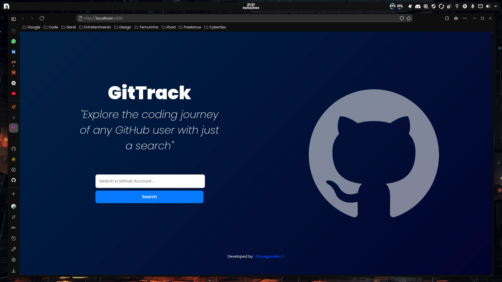

# GitTrack



GitTrack is full stack application with Spring Boot and Angular that consumes the GitHub API to track user activities such as commits, repositories created, and other interactions. 

## Technologies Used
GitTrack leverages the following technologies:

- **Backend:**
    - Spring Boot
    - Maven
    - Java

- **Frontend:**
    - Angular
    - TypeScript

- **Containerization:**
    - Docker
    - Docker Compose

- **Version Control:**
    - Git

## Installation
To install and run GitTrack, follow these steps:

1. Clone the repository:
    ```bash
    git clone https://github.com/cunegundess/GitTrack.git
    ```
2. Navigate to the project directory:
    ```bash
    cd GitTrack
    ```
3. Build the project using Maven:
    ```bash
    mvn clean install
    ```
4. Run the application:
    ```bash
    mvn spring-boot:run
    ```

You can also run it with Docker. Navigate to the `docker-compose.yml` file and run the following command:
```bash
docker compose -f docker-compose.yml up --build
```

## Usage
Once the application is running, the backend will be available at `http://localhost:8080` and the frontend at `http://localhost:4200`

### Endpoints
The following endpoints are available for tracking GitHub user activities:

- **Get User Events**
    - **URL:** `/{username}/events`
    - **Method:** `GET`
    - **Description:** Retrieves details of a GitHub user events by their username.

- **Get User Repositories**
    - **URL:** `/{username}/repos`
    - **Method:** `GET`
    - **Description:** Retrieves a list of repositories for a GitHub user.

- **Get User Commits**
    - **URL:** `/{username}/repos/commits`
    - **Method:** `GET`
    - **Description:** Retrieves a list of commits made by a GitHub user.

## Backlog
### Completed
- Integrate with GitHub API
- Create user interface for tracking activities
- Create getUserRepos method in GithubService class
- Create getUserCommits method in GithubService class
- Create a Dockerfile for containerization

### In Progress
- Add unit tests for service layer

### Planned
- Implement CI/CD
- Refactor the frontend fetching to use the new endpoints
    - Update the service layer to handle new endpoints
    - Modify Angular components to call updated services
    - Ensure proper error handling for new endpoints
    - Update UI to display new data from endpoints

## License
This project is licensed under the MIT License. See the [LICENSE](LICENSE) file for details.
